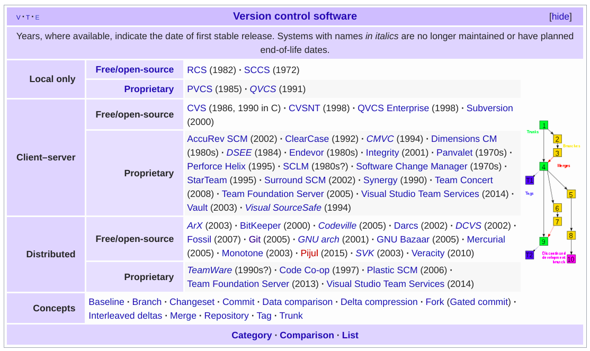
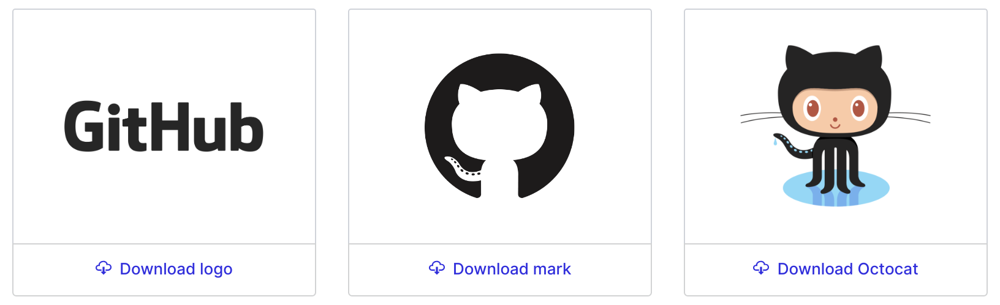
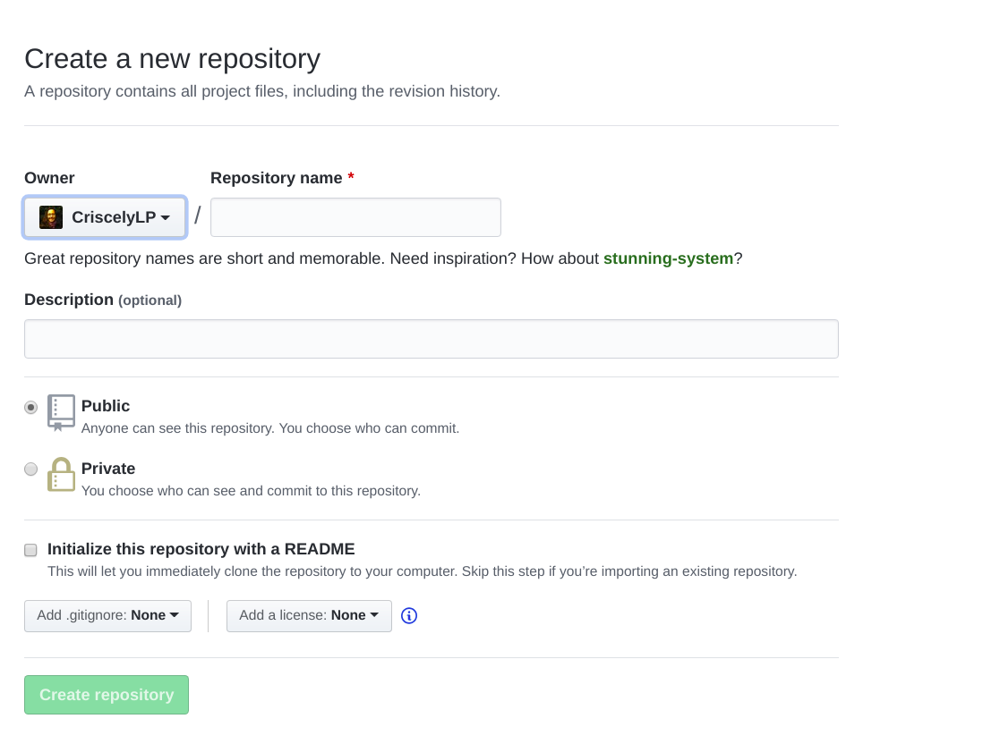
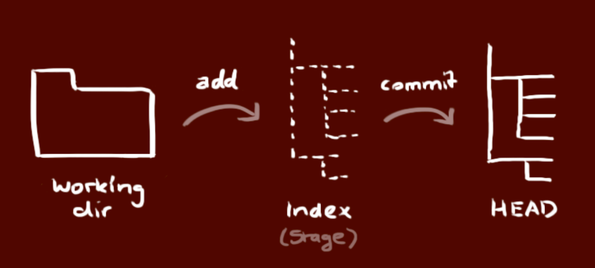

```{r setup, include=FALSE}
options(htmltools.dir.version = FALSE)
```

class: inverse, center, middle

# Keep in touch

<a href="mailto:criscelylujan@gmail.com"><i class="fa fa-paper-plane fa-fw"></i>&nbsp;Personal email: criscelylujan@gmail.com</a><br>
<a href="mailto:criscely.lujan@ird.fr"><i class="fa fa-paper-plane fa-fw"></i>&nbsp; Profesional email: criscely.lujan@ird.fr</a><br>
<a href="http://twitter.com/CriscelyLP"><i class="fa fa-twitter fa-fw"></i>&nbsp; Twitter: @CriscelyLP</a><br>
<a href="http://github.com/CriscelyLP"><i class="fa fa-github fa-fw"></i>&nbsp; GitHub: @CriscelyLP</a><br>


---

background-image: url("https://media.giphy.com/media/3oD3YveOJWdwIAfZ5e/giphy.gif")
background-position: 50% 60%
class: center, inverse
background-size: 700px

# Get start! YEAH!


---

# Why is important version control?

```{r, echo=FALSE, out.width = "350px", fig.align='center', fig.cap="phdcomics.com"}
knitr::include_graphics("img/phd_comics.png")
```

---

# Why is important version control?

--

The version control is important for:

<br> 
--

- Storing version (properly)

<br> 

--

- Restoring previous versions

<br> 

--

- Collaborations

<br> 

--

- Save time! 

<br> 

---

# Version control software

--

```{r, echo=FALSE, out.width = "1000px", fig.align='center', fig.cap="Wikipedia"}


```

---

# Why git?

--

Git is a distributed version-control system for tracking changes in source code during the development of software.

--

<br> 
<br> 
<br> 

```{r, echo=FALSE, out.width = "500px", fig.align='center', fi}

knitr::include_graphics("img/git_logo.png")
```

---

# Why git?

--
- Distributed
    - Work online or offline
    - Collaborate with large groups

--

- Popular and Successful
    - Active development
    - Shiny new tools
    - Fast

--

- Tracks any type of file
    - Works best with text 

--

- Branching
    - Smarter merges
--

<br> 
<br> 
**Slide taken from [Mine Cetinkaya-Rundel](http://rpubs.com/mine/rladies-git)**.

---

# GitHub Inc.

--

A web-based hosting service for version control using Git.

[GitHub](https://github.com/)

<br> 
<br> 

```{r, echo=FALSE, out.width = "900px", fig.align='center'}


```

---

# GitHub Inc.

- Access to the control and collaboration features for every `project`.

<br> 

--

- Work with public and private `repositories`.

<br> 

--

- Develop a `networking`.

<br> 

--

- `Plans` for enterprise, teams, pro and free accounts.

<br> 

--

- Is the `largest host of source code` in the wordl! (28 million users and 57 million repositories until Jube 2018).

---

# Register a GitHub account

--

- Register an account with [GitHub](https://github.com/) is free!

<br> 

--

- Free private repos
  - Students, faculty, and educational/research staff: [GitHub Education](https://education.github.com/)
  - Official nonprofit organizations and charities: [GitHub for Good](https://github.com/nonprofit)

<br> 

--

- Pay for private repos
  - $7/month: [GitHub Pricing](https://github.com/pricing)

<br> 

--

- Tips about the name acount:
  - Use your actual name!
  - Shorter is better than longer!
  - Be as unique as possible!
  - Reuse your name from other context, e.g. `Twitter` or `Slack`!

---

# Git is already installed?

--

To check that go to shell (terminal / command line / console) and enter `which git` to request the path to your Git executable: 

--

```{bash}
which git
```

--

<br> 

Then enter `git --version` to see its version

```{bash}
git --version
```

--

<br> 
<br> 

- **If git is not installed YET**: See [Install git](https://happygitwithr.com/install-git.html) to follow the correct steps to install git according your system operative! :)

---

# Introduce yourself to Git

Let `git` know how you are following this simple configuration steps!

--

```bash
$ git config --global user.name "Criscely Lujan"
$ git config --global user.email "criscelylujan@gmail.com"
$ git config --global core.editor vim
$ git config --global --list
```
--

- `user.name` can be your GitHub username. Your commits will be labelled with this name, so this should be informative!

--

- `user.email` must be the email that you use to sign up for GitHub.

--

- There are diverse options of [Git editor](http://swcarpentry.github.io/git-novice/02-setup/).


---

# Git Clients

--

- Git and Git client `are not` the same! Like R and RStudio is not the same thing! 💜

<br>

--

- Git client: 
  - Integrated development environment!
  - Make the experience more pleasant providing a richer visual representation!

<br>

--

- Some Git clients:
  - [SourceTreen](https://www.sourcetreeapp.com/)
  - [GitKraken](https://www.gitkraken.com/)
  - [GitUp](https://gitup.co/)
  - [SmartGit](https://www.syntevo.com/smartgit/)
  - [git-cola](https://git-cola.github.io/)
  - ... others...
  - **RStudio**

---

background-image: url("https://media.giphy.com/media/31Q36EHJ7C5ZoIMw79/giphy.gif")
background-position: 50% 50%
class: center, inverse

# Almost ready!

---

# How authenticating yourself with GitHub?

--

There are two options of protocols for secure communication working over a computer network!

--

- Hypertext Transfer Protocol Secure (HTTPS)

.pull-rigth[

```{r, echo=FALSE, out.width = "200px", fig.align='center'}


```

]

--

If you plan to push/pull using HTTPS protocol, you can follow [Cache credentials for HTTPS](https://happygitwithr.com/credential-caching.html#credential-caching) for more information. 

--

- Secure Shell (SSH)

.pull-rigth[

```{r, echo=FALSE, out.width = "100px", fig.align='center'}


```

]

--

If you plan to push/pull using SSH protocol, you can follow [Set up keys for SSH](https://happygitwithr.com/ssh-keys.html#ssh-keys) for more information.

---

# RStudio and GitHub

<br> 
--

## Setup Git + RStudio + GitHub

--

- Tools / Global Options / Select Git/SVN tab.
- Create the RSA key.
- Click, View public key, and copy the displayed public key.
- Save the key on your GitHub account: Settings / SSH key / Add SSH key.

<br> 

Step by step here: [Connecting RStudio and GitHub](https://www.r-bloggers.com/rstudio-and-github/) 

---

background-image: url("https://media.giphy.com/media/26AHyxxCItIbFijLO/giphy.gif")
background-position: 50% 50%
class: center, inverse

# Now we can really have fun!

---

# Make a new repo

- Go to https://github.com and login. Click in the green box called `New repository`.

--

- If you are on your own profile page, go to the section `Repositories`, then click the green box called `New`.

--

- Assign a name for the `repository` and include a `description` (this is optional but is recommended!).

--

- Public or private.

--

- Initializa the repository using the `README`.

---

```{r, echo=FALSE, out.width = "800px", fig.align='center'}


```

---

# Clone a repo

## Using RStudio

- File -> New Project

--

- Version control

--

- Git

--

- Fill `Repository URL` and project name (what you want the folder to be called locally). 

---

# Clone a repo

## Using terminal

- Create a new directory, open it and perform `git init` to create a new git repository:

```{r, eval = FALSE}
git init
```

--

- Clone the repository running the command `git clone` plus the path:

```{r, eval = FALSE}
git clone /path/to/repository
```

--

- When you are using a remote server, your command will be:
`git clone username@host:/path/to/repository`

- For example:
```{r, eval = FALSE}
git clone git@github.com:r-ladies-montpellier/20181212-RLadiesMontpellier-Meetup1.git
```

---

# Workflow

Your local repository consists of three "trees" maintained by git.

<br> 

```{r, echo=FALSE, out.width = "800px", fig.align='center'}


```

---

# Add and commit

- After clone the repository already clone on your computer, you can make changes and propose changes using `add` and `commit`: 

For specific file:
```{r, eval = FALSE}
git add <filename>
```

--

Or adding all changes:
```{r, eval = FALSE}
git add .
```

--

Commit!
```{r, eval = FALSE}
git commit -m "Commit message"
```

--

Now the file (or changes in general) is committed to the `HEAD`, but not in your remote repository YET!

---

# Pushing changes

--

When your changes are in `HEAD`, your are ready to sent those changes to your remote repository, executing:

--

```{r, eval = FALSE}
# If your are not working in "master", change the branch
git push origin master
```

--

<br>
<br>

## If you dont know that is a `branch`, the next slide is for YOU! 💜 

---

background-image: url("https://media.giphy.com/media/FX7A7ZBnOgz3W/giphy.gif")
background-position: 50% 80%
class: center, inverse
background-size: 500px

# Branches are used to develop features ISOLATED from each other!

---

# Branching

--

- The `master` branch is the default branch when you create a repository.

<br> 

--

- We can create other branch for the development of other features (example: `develop` branch).

<br> 

--

- We can merge branches.

--

```{r, echo=FALSE, out.width = "700px", fig.align='center'}


```

---

# Branching

Create a new branch named `feature_x` and switch to it using :
```{r, eval = FALSE}
git checkout -b feature_x
```
--

Switch back to `master`:
```{r, eval = FALSE}
git checkout master
```

--

To delete the brach `feature_x`:
```{r, eval = FALSE}
git branch -d feature_x
```

--

IMPORTANT!!!!!
Any branch in your local repository is available to others users unless you push the branch to the remore repository, doing:

```{r, eval = FALSE}
git push origin feature_x
```

---

# Update and merge

--

To update your local repository to the newest commit, execute:

```{r, eval = FALSE}
git pull
```

--

To merge another branch into your active branch (for example: master), use:

```{r, eval = FALSE}
git merge <branch>
```

--

Before marging changes in branch you can also see the differences!

```{r, eval = FALSE}
git diff <source_branch> <target_branch>
```

--

More information about git commands here: [Git the Simple guide](http://rogerdudler.github.io/git-guide/)

---

```{r, echo=FALSE, out.width = "600px", fig.align='center'}

knitr::include_graphics("img/git_scheme.png")
```

---

# Exercise

- Create a repo in GitHub.

- Clone the repo in your computer.

- Make changes (editting also the README.md and .gitignore)

- Make commits, if is possible include emojis to have fun! :)

- Use: push / pull / merge / status / etc.

- Check the changes in you remore repository.

- Develop a new branch, delete it, play, enjoy and ...

# ...be in problems, we are here to help you! 

---

background-image: url("https://media.giphy.com/media/4EF5xIO5yiivWh4gGn/giphy.gif")
background-position: 50% 80%
class: center, inverse
background-size: 500px

# Follow the [R-Ladies Montpellier ](https://github.com/r-ladies-montpellier) in GitHub.

---

# Thanks!

- [R-Ladies Global](https://rladies.org/) for the help and support.

- [Jenny Bryan](https://github.com/jennybc): [Happy Git with R](https://happygitwithr.com/).

- Slides created via the R package [**xaringan**](https://github.com/yihui/xaringan) with the [**R-Ladies theme**](https://github.com/rladies/resources/blob/master/xaringan-slides/how_to_use.md) 

- [Cowork'in Montpellier](http://coworkinmontpellier.org/)

<br> 

```{r, echo=FALSE, out.width = "300px", fig.align='center', fig.cap="phdcomics.com"}

```
